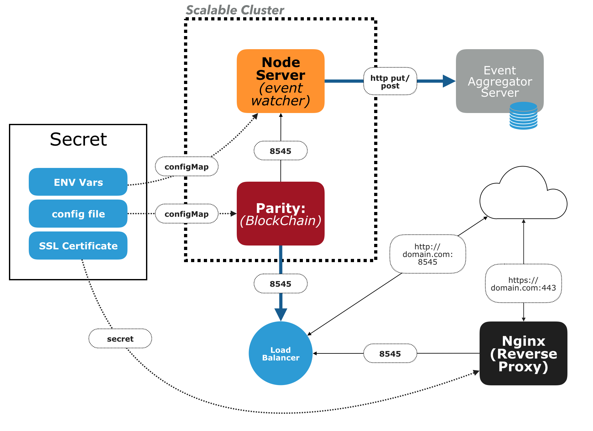

# Parity / Ethereum Node Cluster

## Objective
Create a cluster of nodes that connect to the Ethereum blockchain using the parity client to support services for a decentralized application.



## Current State
The following error is being logged with creating the node generated by replication controller `nginx-ingress-controller` [yml](parity-rp/08-nginx-ingress-repl-controller.yml)

```
I0321 04:37:55.706844       1 main.go:94] Using build: https://github.com/bprashanth/contrib.git - git-92b2bac
W0321 04:38:25.790566       1 main.go:118] unexpected error getting runtime information: timed out waiting for the condition
F0321 04:38:25.811692       1 main.go:121] no service with name parity-rp/parity-service found: services "parity-service" is forbidden: User "system:serviceaccount:parity-rp:default" cannot get services in the namespace "parity-rp": Unknown user "system:serviceaccount:parity-rp:default"
```

- Expected solution: cluster role bindings to enable access
- Initial template file [rbac.yml](/parity-rp/rbac.yaml) has some roles which are failing to create:

```
Error from server (Forbidden): error when creating "rbac.yaml": clusterroles.rbac.authorization.k8s.io "nginx-ingress-clusterrole" is forbidden: attempt to grant extra privileges: [PolicyRule{Resources:["configmaps"], APIGroups:[""], Verbs:["list"]} PolicyRule{Resources:["configmaps"], APIGroups:[""], Verbs:["watch"]} PolicyRule{Resources:["endpoints"], APIGroups:[""], Verbs:["list"]} PolicyRule{Resources:["endpoints"], APIGroups:[""], Verbs:["watch"]} PolicyRule{Resources:["nodes"], APIGroups:[""], Verbs:["list"]} PolicyRule{Resources:["nodes"], APIGroups:[""], Verbs:["watch"]} PolicyRule{Resources:["pods"], APIGroups:[""], Verbs:["list"]} PolicyRule{Resources:["pods"], APIGroups:[""], Verbs:["watch"]} PolicyRule{Resources:["secrets"], APIGroups:[""], Verbs:["list"]} PolicyRule{Resources:["secrets"], APIGroups:[""], Verbs:["watch"]} PolicyRule{Resources:["nodes"], APIGroups:[""], Verbs:["get"]} PolicyRule{Resources:["services"], APIGroups:[""], Verbs:["get"]} PolicyRule{Resources:["services"], APIGroups:[""], Verbs:["list"]} PolicyRule{Resources:["services"], APIGroups:[""], Verbs:["watch"]} PolicyRule{Resources:["ingresses"], APIGroups:["extensions"], Verbs:["get"]} PolicyRule{Resources:["ingresses"], APIGroups:["extensions"], Verbs:["list"]} PolicyRule{Resources:["ingresses"], APIGroups:["extensions"], Verbs:["watch"]} PolicyRule{Resources:["events"], APIGroups:[""], Verbs:["create"]} PolicyRule{Resources:["events"], APIGroups:[""], Verbs:["patch"]} PolicyRule{Resources:["ingresses/status"], APIGroups:["extensions"], Verbs:["update"]}] user=&{carlol@coinalpha.com  [system:authenticated] map[authenticator:[GKE]]} ownerrules=[PolicyRule{Resources:["selfsubjectaccessreviews"], APIGroups:["authorization.k8s.io"], Verbs:["create"]} PolicyRule{NonResourceURLs:["/api" "/api/*" "/apis" "/apis/*" "/healthz" "/swagger-2.0.0.pb-v1" "/swagger.json" "/swaggerapi" "/swaggerapi/*" "/version"], Verbs:["get"]}] ruleResolutionErrors=[]

Error from server (Forbidden): error when creating "rbac.yaml": roles.rbac.authorization.k8s.io "nginx-ingress-role" is forbidden: attempt to grant extra privileges: [PolicyRule{Resources:["configmaps"], APIGroups:[""], Verbs:["get"]} PolicyRule{Resources:["pods"], APIGroups:[""], Verbs:["get"]} PolicyRule{Resources:["secrets"], APIGroups:[""], Verbs:["get"]} PolicyRule{Resources:["namespaces"], APIGroups:[""], Verbs:["get"]} PolicyRule{Resources:["configmaps"], ResourceNames:["ingress-controller-leader-nginx"], APIGroups:[""], Verbs:["get"]} PolicyRule{Resources:["configmaps"], ResourceNames:["ingress-controller-leader-nginx"], APIGroups:[""], Verbs:["update"]} PolicyRule{Resources:["configmaps"], APIGroups:[""], Verbs:["create"]} PolicyRule{Resources:["endpoints"], APIGroups:[""], Verbs:["get"]}] user=&{carlol@coinalpha.com  [system:authenticated] map[authenticator:[GKE]]} ownerrules=[PolicyRule{Resources:["selfsubjectaccessreviews"], APIGroups:["authorization.k8s.io"], Verbs:["create"]} PolicyRule{NonResourceURLs:["/api" "/api/*" "/apis" "/apis/*" "/healthz" "/swagger-2.0.0.pb-v1" "/swagger.json" "/swaggerapi" "/swaggerapi/*" "/version"], Verbs:["get"]}] ruleResolutionErrors=[]
```

## Components
1. Parity node (image: parity/parity:stable): client that connects to the Ethereum blockchain
  - typically suffers from performance issues; syncing of data to the blockchain from time to time gets stuck or freezes; and when a node falls behind and catches up, this results in data to be missed (see [Parity sync problem](https://ethereum.stackexchange.com/questions/42647/1-parity-why-does-syncing-fall-behind-2-why-are-events-missing-events-beca?noredirect=1#comment48352_42647))
  - resolution for a node that gets "stuck": restart parity
  - large amount of data, currently around 50GB. Therefore, destroying and bringing up new instances is problematic, since it takes a long time for a node to sync (may be multiple days)
  - external services/clients connect to the node via [web3](https://github.com/ethereum/web3.js/) http connection to port `8545`
  - Proposed plan: create multiple nodes for redundancy (3x) that are readily available
  - Tracking for faults: a web3 command can be used to query the current node's most recently synced block number (`web3.eth.getBlockNumber()`).  This can be compared with the return value of other nodes or with external, third party APIs.  If the node, for example, falls behind by 10 blocks, the node should be taken out of service.  It should then be monitored for some time until it catches up; if after a while, the node still doesn't catch up, parity should be restarted.
  - **liveness check**: web3 can connect and returns a value for web3.eth.getBlockNumber()
  - **readiness check**: returned block number value is the same as a third party number / other nodes

2. Nginx reverse proxy server with SSL certificate
  - a secure, front end client (https) connecting to the parity node via web3 requires an https connection; since parity does not natively support SSL, an nginx reverse proxy server is needed to connect to parity on port 8545 and serve that on a secure port 443 with a TLS certificate

3. Node server
  - this service is a node application that connects to parity via web3/port 8545, to collect and monitor information from the blockchain (via parity)
  - due to reliability issues of parity nodes, each parity node will have its own instance of a node server to monitor events.  When an event is detected, the node server will send this data to a separate, aggregator stateful service.  This service will have a database to store detected events.  When the aggregator receives a new event (not stored in the db), that event is stored and processed, used for other systems.  When a second, redundant node sends the same event, the aggregator first queries the database if that event is already known; if so, redundant received events are ignored
  - Note: whenever parity restarts, this server should also be restarted once that parity node is restarted and up and running.
  - this should be started once the parity node's liveness check is successful

**Load balancing**
Clients may connect to the non secure port (http://domain.com:8545) or the secure port (https://domain.com:443).  This workload should be shared between the multiple parity instances.